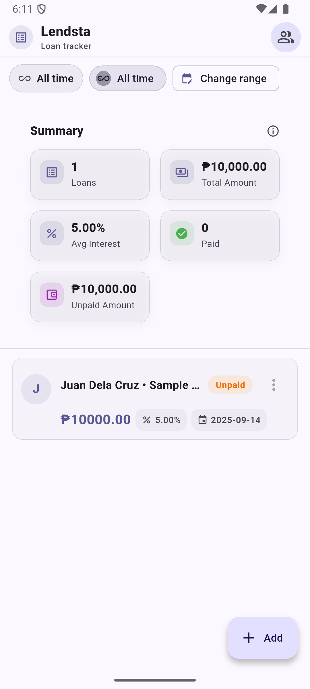
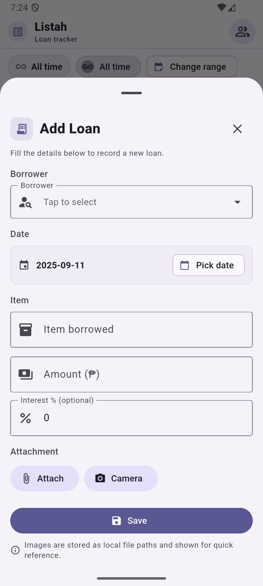
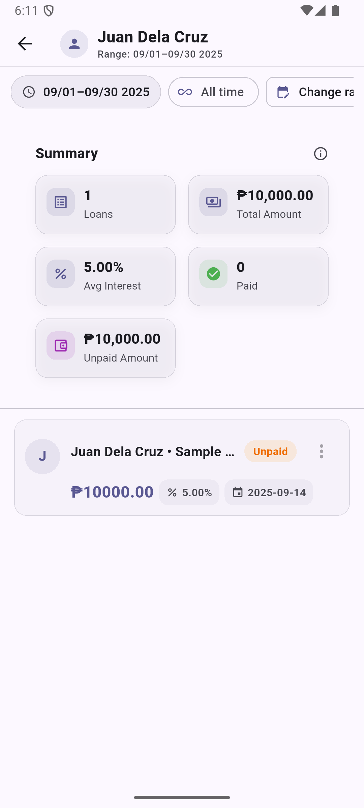

<div align="center">

# Lendsta

Smart, simple loan tracking for individuals and small teams.

<br />


</div>

---

## Overview

Lendsta (formerly “Listah”) is a Flutter app that helps you record loans, track repayment status, and keep a tidy overview for each person. It stores data locally using SQLite via `sqflite` and aims to be fast, offline-first, and easy to use.

### Highlights
- Add loans with borrower, item, amount, interest, date, and optional photo attachment.
- Two statuses only: Paid or Unpaid (Approved/Pending removed).
- Dashboard summary: total loans, total amount, average interest, paid count, and unpaid amount.
- Per-person summary with the same key metrics.
- Clean list and detail views with overflow-safe UI and ellipsized text.

## Screens

> Add screenshots to `docs/screens/` and update paths below.

| Dashboard | Add Loan | Person Details |
| --- | --- | --- |
|  |  |  |

## Getting Started

### Prerequisites
- Flutter 3.x
- Dart 3.x

### Setup
```bash
flutter pub get
flutter run
```

### Platforms
- Android only: run on a device or emulator.

## Project Structure

```
lib/
  app.dart                 # MaterialApp + theming
  main.dart                # Entry point
  data/loans_db.dart       # SQLite (sqflite) database + queries
  models/                  # Data models
  screens/                 # Pages (dashboard, people, person detail)
  sheets/                  # Bottom sheets (add loan, borrower picker)
  theme/                   # Light/dark theme
  utils/                   # Formatting helpers
  widgets/                 # Reusable UI components
```

## Data & Migrations

- Storage: `sqflite` (local SQLite database).
- Current schema version: 4.
- Migration v4 collapses statuses to two values: `paid` and `unpaid`. All legacy non-`paid` statuses are updated to `unpaid` automatically.
- Summaries compute unpaid amount dynamically (sum of amounts where status != `paid`).

## Development Notes

- UI is tuned to avoid overflow: long names and labels use `TextOverflow.ellipsis` and wrapping where appropriate.
- Attachments are stored as local file paths and shown inline in details.

## Contributing

1. Fork and branch from `main`.
2. Run `flutter format . && flutter analyze` before opening a PR.
3. Keep changes focused and documented in the PR description.

## Acknowledgements

Built with Flutter and a lot of love for tidy UIs.
